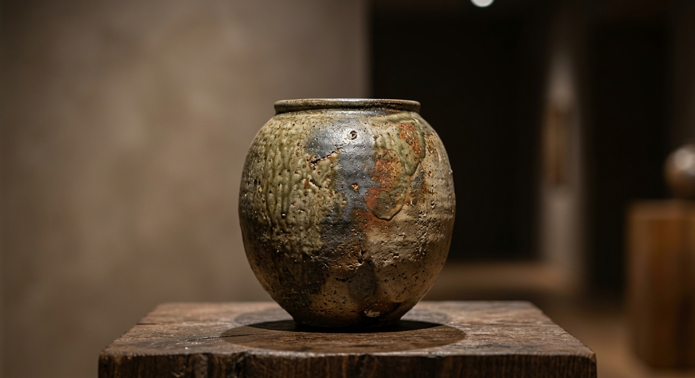
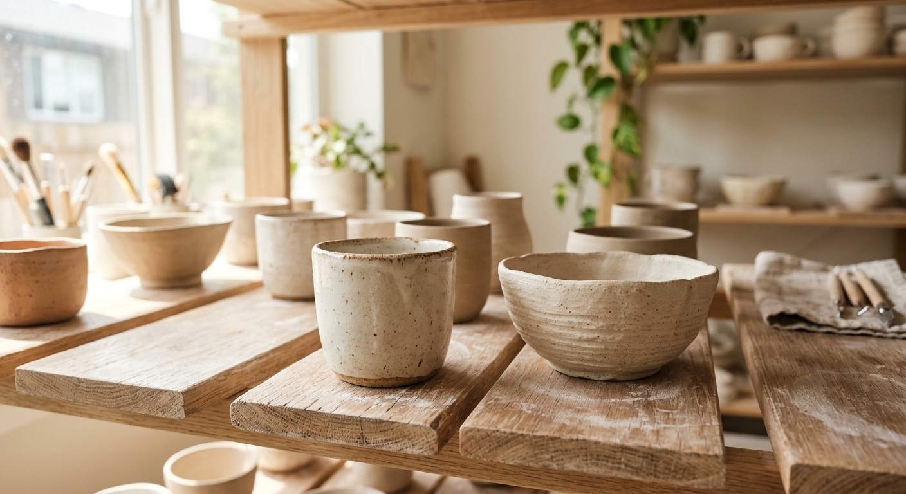
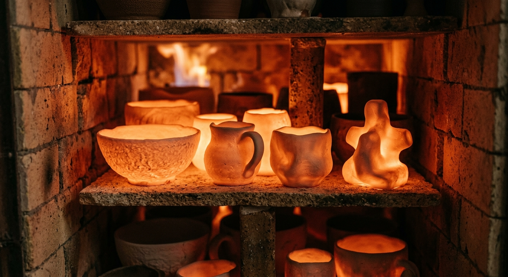
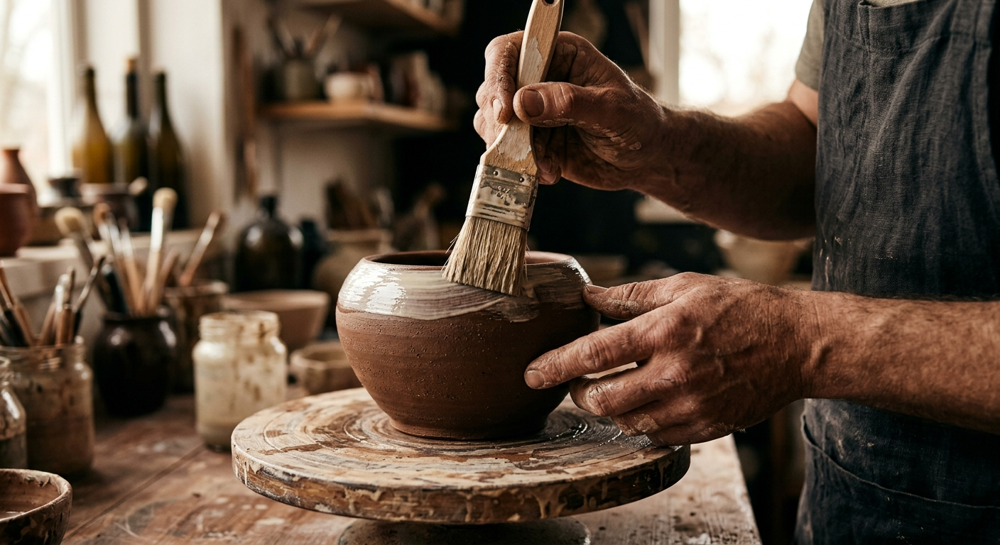

<!--
   Artisana — Cinematic Artisan Portfolio Website
   Designed with soul. Crafted with intention.
-->

<div align="center">
  
  <!-- Branding Header -->
  <p align="center">
    <samp>A E S T H E T I C · M O T I O N · C R A F T</samp>
  </p>
  
  # 🏺 ARTISANA
  
  ### *Where Craft Becomes Art*
  
  **A cinematic, editorial-grade storytelling portfolio designed for luxury handcrafted pottery, jewelry, paintings, and textiles.**

  [](https://react.dev)
  [](https://vite.dev)
  [](https://tailwindcss.com)
  [](https://motion.dev)
  [](https://github.com/darkroomengineering/lenis)
  [](LICENSE)

  ---

  [🏛️ Explore Live Experience](https://github.com/Vanjinathan23/Artisan_Portfolio) · [🎥 View Cinematic Walkthrough](#project-preview) · [💬 Request Commission](#installation--setup)

</div>

<br />

---

## 📽️ Project Preview

<div align="center">
  
  <!-- Placeholder for cinematic gif/image -->
  
  
  <p align="center">
    <i>An immersive digital gallery featuring an interactive custom cursor, fluid typography, and premium physics-based motion.</i>
  </p>
  
  <br />
  
  <!-- Inline carousel of features -->
  <table>
    <tr>
      <td width="33%"><br /><center><small><b>01. Slow Crafting</b></small></center></td>
      <td width="33%"><br /><center><small><b>02. Firing Rituals</b></small></center></td>
      <td width="33%"><br /><center><small><b>03. Material Selection</b></small></center></td>
    </tr>
  </table>

</div>

---

## 📜 About The Project

Most portfolios are built like static spreadsheets—cold, grid-locked, and indifferent. 

**Artisana** was born out of a rebellion against the ordinary. It is an emotional, cinematic storefront and canvas designed specifically for creators who build with their hands. For potters, painters, jewelry designers, and weavers, their work is not just a list of specifications. It is a lineage of patience, materials, and time.

Artisana translates this physical presence into digital soul:
* **The Story Over The Grid**: Instead of plain galleries, each piece is presented with its backstory, inspiration, and crafting time.
* **The Rhythm of Slow Motion**: Powered by custom easing and smooth scroll physics, navigation feels heavy and intentional, mirroring the tactile rhythm of shaping clay or throwing shuttle.
* **Tactile Interactions**: A magnetic cursor system and soft preloader build anticipation, preparing the viewer for a gallery experience rather than a hurried webpage scroll.

---

## ✨ Core Features

| Feature | Description | Implementation |
| :--- | :--- | :--- |
| **Cinematic Hero** | A dual-panel entry splitting tactile visuals from bold, editorial storytelling text. | `Tailwind Grid` + `Motion.div` stagger |
| **Lenis Smooth Scroll** | Eliminates rigid browser scrolling, replacing it with fluid, momentum-based travel. | `lenis` core engine initialization |
| **Physics Custom Cursor** | A dual-ring cursor with magnetic hovering states and organic drag notifications. | `useMotionValue` + `useSpring` |
| **Glassmorphism Navbar** | An elegant, floating header that shifts opacity and blurs on scroll. | `IntersectionObserver` & state logic |
| **Masonry Collection Grid** | An asymmetric gallery layout grouping products in natural, editorial dimensions. | CSS Grid spans + `layout` transitions |
| **Detailed Storytelling Modal** | Interactive detail cards that emerge smoothly to present craft background details. | `AnimatePresence` modal overlays |
| **Responsive Continuity** | Fluid layouts scaling smoothly from ultra-wide 4K monitors down to mobile viewports. | Tailwind fluid typography utilities |
| **WhatsApp Enquiry Pipeline** | Direct-to-artisan communication pre-populated with item detail links. | Direct WhatsApp API query integration |

---

## 🎨 Design Philosophy

```
  WALNUT (#251F1C)   ──────   Deep, earthy base providing luxury contrast.
  TERRA (#B85C38)    ──────   Warm terracotta orange representing fire and clay.
  CREAM (#FBF8F3)    ──────   Soft off-white background mirroring unglazed bisque.
  LINEN (#F4ECE1)    ──────   Textured warm grey for structured panels.
  SAND (#E0D3C1)     ──────   Muted gold highlighting interactive details.
```

### 🏺 Handmade-Inspired UI
Every line, border, and background color has been chosen to reflect tactile materials. We intentionally avoid bright synthetic primaries, leaning instead on warm mineral pigments: clays, wood ash, copper oxide, and raw linen.

### ✍️ Editorial Typography & Layout
Inspired by premium lifestyle magazines, the visual system pairs clean, geometric sans-serif details with large, airy serif titles. This hierarchy creates a balance between historical craft and modern minimal luxury.

### ⏳ Cinematic Motion
We believe animation should not distract, but immerse. Transitions leverage slow, high-damping springs (`stiffness: 150`, `damping: 20`) to create a sensation of physical mass and weight.

---

## 🛠️ Tech Stack

```
   ┌─────────────────────────────────────────────────────────────┐
   │                       FRONTEND CORE                         │
   ├───────────────┬──────────────────────────────┬──────────────┤
   │ React 19      │ TypeScript                   │ Vite         │
   └───────────────┴──────────────────────────────┴──────────────┘
   ┌─────────────────────────────────────────────────────────────┐
   │                     MOTION & DESIGN                         │
   ├───────────────┬──────────────────────────────┬──────────────┤
   │ Motion / React│ Lenis Scroll                 │ Tailwind v4  │
   └───────────────┴──────────────────────────────┴──────────────┘
```

* **Framework:** React 19 (Hooks, `useMemo`, `useRef`, custom state)
* **Build System:** Vite (Lightning-fast HMR and build pipelines)
* **Styling Engine:** Tailwind CSS v4 (Leveraging native CSS variables and modern grid utilities)
* **Animation System:** Motion / React (Framer Motion) for layouts, springs, and exit animations
* **Scrolling Physics:** Lenis (For buttery-smooth, hardware-accelerated inertia)
* **Iconography:** Lucide Icons (Minimal, clean vector assets)

---

## 📂 Folder Structure

```
artisana-handcrafted-with-soul/
├── src/
│   ├── assets/
│   │   └── images/          # Compressed artisan process images
│   ├── App.tsx              # Main entry point housing app layout and state
│   ├── main.tsx             # React DOM root setup
│   └── index.css            # Custom fonts, Tailwind styles, and easing definitions
├── .env.example             # Environment template
├── index.html               # Main HTML wrapper (Editorial Serif font imports)
├── package.json             # Manifest and dependencies
├── tsconfig.json            # Strict TypeScript configuration
└── vite.config.ts           # Vite compile and build configurations
```

---

## 🚀 Installation & Setup

Get Artisana running locally in under two minutes:

### Prerequisites
* [Node.js](https://nodejs.org/) (v18 or higher recommended)
* npm (comes bundled with Node)

### Step-by-Step

1. **Clone the Repository**
   ```bash
   git clone https://github.com/Vanjinathan23/Artisan_Portfolio.git
   cd Artisan_Portfolio
   ```

2. **Install Dependencies**
   ```bash
   npm install
   ```

3. **Configure Environment** (Optional)
   ```bash
   cp .env.example .env.local
   ```

4. **Launch Local Server**
   ```bash
   npm run dev
   ```
   *The experience will now be live at* `http://localhost:3000/`

5. **Build for Production**
   ```bash
   npm run build
   ```

---

## 📱 Responsive Continuity

Artisana does not compromise. Every viewport is treated as a unique layout challenge:
* **The Desktop Experience:** Multi-column grids, hovering detail highlights, immersive custom cursor ring, and smooth inertia scroll.
* **The Tablet Experience:** Responsive flex structures shifting to touch-friendly interaction dimensions while retaining the rich background gradients.
* **The Mobile Experience:** Simplified single-column timeline, touch scroll with fallback gesture listeners, and a responsive overlay navigation panel.

---

## ⚡ Performance Optimizations

To deliver an award-winning user experience, the website maintains clean, lightweight mechanics:
* **Optimized Image Deliveries**: Core gallery and process cards utilize modern web compressions to load instantly without rendering delays.
* **Hardware-Accelerated Physics**: Custom springs run on independent GPU threads via Framer Motion to prevent screen tearing and layout shifts.
* **Passive Event Listeners**: Window scrolls and drag handlers leverage passive declarations to ensure browser thread smoothness.

---

## 🔮 Future Enhancements

* 🌗 **Chiaroscuro Mode:** A light/dark contrast switcher inspired by high-contrast studio shadows.
* 📦 **Artisan Dashboard:** A clean, minimal writer interface to log details, firing times, and materials.
* ✍️ **AI Storyteller Integration:** A generative assistant to help creators write evocative bios for their creations based on textures and firing techniques.
* 🌐 **Multi-lingual Contexts:** Japanese, French, and Hindi localizations to support global artisan stories.

---

## 🏛️ Credits

* **Editorial Layouts:** Inspired by modern architectural digest covers and luxury catalogs.
* **Tactile Inspiration:** Rooted in traditional ceramic studios of Shigaraki (Japan) and Rajasthan (India).
* **Open Source Gems:** A massive thank you to the creators of `lenis` and `motion` for enabling fluid movement on the web.

---

## 👤 Author

<table border="0">
  <tr>
    <td width="110px">
      
    </td>
    <td>
      <b>Vanji Nathan</b><br />
      <i>Creative Developer & Designer</i><br />
      <a href="https://github.com/Vanjinathan23">💻 GitHub</a> · 
      <a href="https://linkedin.com">💼 LinkedIn</a> · 
      <a href="https://portfolio.example.com">🎨 Portfolio</a>
    </td>
  </tr>
</table>

---

<div align="center">
  
  *Crafted with intention. Designed with soul.*  
  **© 2026 Artisana. Open Source under the Apache-2.0 License.**

</div>
